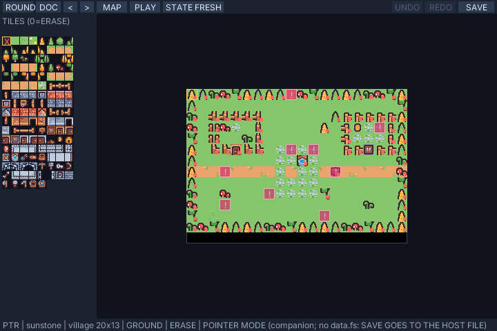
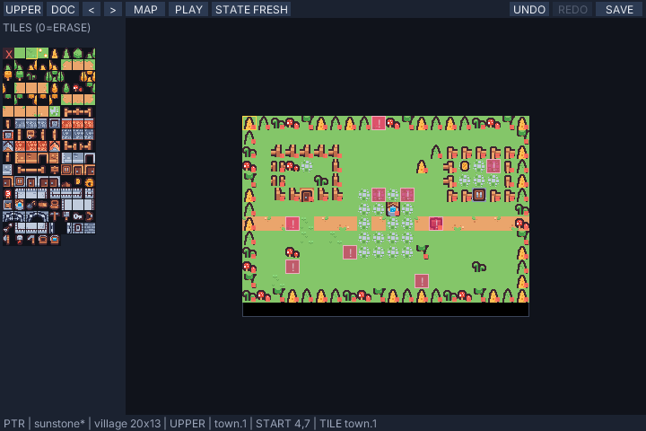
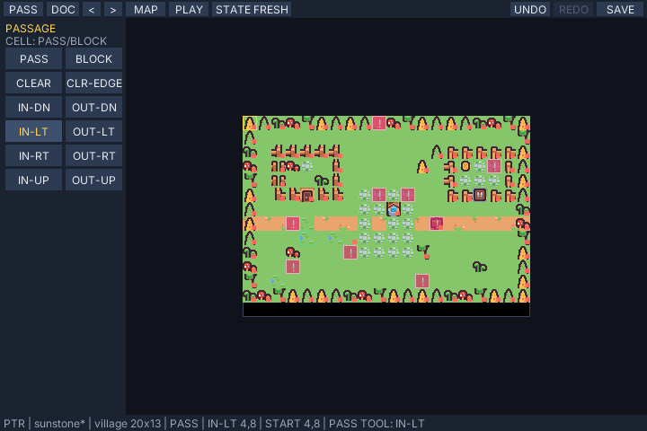
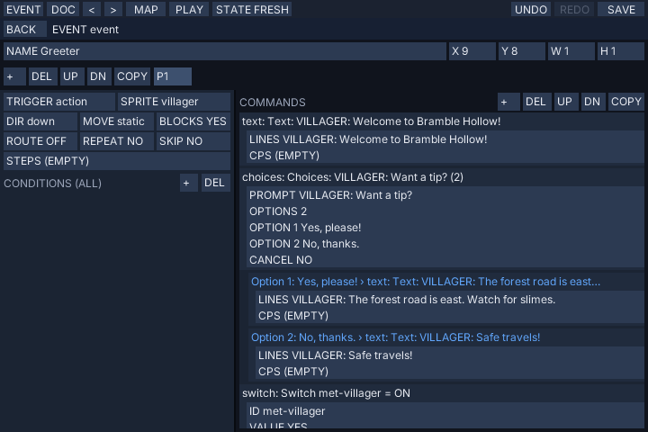
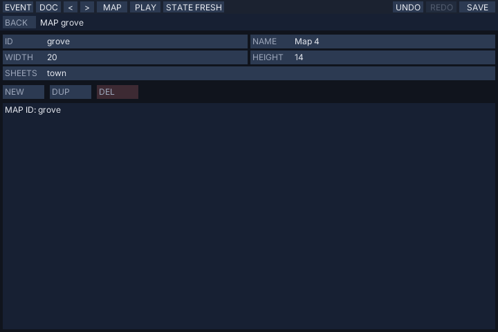
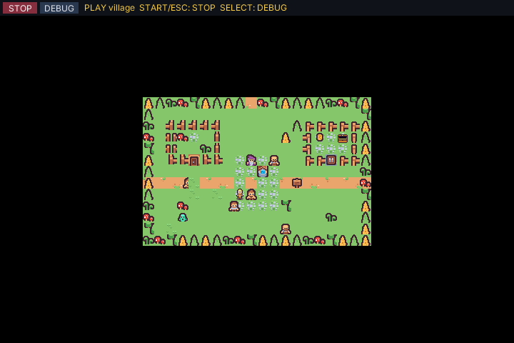
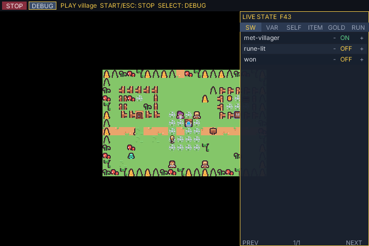

# Editor tutorial: a villager, a reward, and a second map

This tutorial follows one small scenario from start to finish. Starting from
the Sunstone example, you will:

- paint a path, a blocked cell, and a one-way edge;
- add a villager NPC with branching dialog, a switch, and a one-time gold
  reward paid on the second visit;
- create a second map and connect both maps with portals;
- play-test the result with the live debugger;
- save, and run the finished project in your own game;
- reproduce the same edits with the `rpgkit-edit` CLI and an MCP agent.

Prerequisites: `bun install` in the repository root. The editor builds its
bundle and desktop host on first launch, so the first start takes longer.

The editor works on a **working copy** at `dist/editor/sunstone.json`, seeded
from the example document the first time. Nothing you save touches the
example. Every figure in this page is regenerated by
`bun tools/editor-tutorial-shots.ts`, which drives the headless editor
through the same steps; `tests/editor-tutorial.test.ts` performs steps 3–5
and 7 headlessly, so the document goes red if it drifts from the
implementation.

## 1. Start the editor and look around

```sh
bun run editor
```

The window opens on the Sunstone project's **village** map:



- The **header** holds, from left to right: the **LAYER** button (shows the
  current mode), **DOC** (switch bundled documents), **<** / **>** (switch
  maps), **MAP** (map inspector), **PLAY**, **STATE FRESH/LAST**, **UNDO**,
  **REDO**, and **SAVE**.
- The **tile palette** on the left shows every cell of the sheets the current
  map declares, eight columns wide. Slot 0 (top-left, red X) is the eraser.
- The **canvas** shows up to a 20×14-cell window onto the map, 16 pixels per
  cell. The status bar at the bottom shows the document, map, mode, brush,
  cursor cell, and notices.

The **LAYER** button cycles the four editing modes: **GROUND → UPPER → PASS
→ EVENT**. You will use all four in this tutorial.

## 2. Paint tiles, undo, and paint passage

**GROUND mode** (the default). Click the third slot in the tile palette —
the path tile (`town.1`). Drag across cells (4,8) to (6,8): three path cells
painted, one undo step.

Switch to **UPPER** (click LAYER once) and click cell (4,7). Upper-layer
tiles draw above characters at runtime, so this path tile will float over
the player's head.



Press **UNDO** and **REDO** in the header (or Cmd+Z / Cmd+Shift+Z; Cmd is
Ctrl on Linux) — the three cells disappear and reappear. Every tile drag is
one history step, 64 deep.

Switch to **PASS** (click LAYER twice). The palette is replaced by the PASS
tools: **PASS**, **BLOCK**, **CLEAR**, **CLR-EDGE**, and the **IN-\*/OUT-\***
edge tools.

- Click **BLOCK**, then click cell (7,8). A red corner marker appears: the
  cell is now impassable.
- Click **IN-LT**, then click cell (4,8) — one of your path cells. A blue
  arrow appears on all three path cells: they can now only be *entered from
  the left*.



The arrow appears on all three cells because **edges belong to the sheet
tile, not the map cell**. Painting IN-LT on a `town.1` cell writes an
`enter: ["left"]` rule onto the `town` sheet's `town.1` tile, so every map
cell painted with that tile gets the rule. **CLR-EDGE** removes it. Passage
overrides (PASS/BLOCK/CLEAR) are per-cell instead. Both are undoable.

## 3. A villager who talks, branches, and rewards once

Switch to **EVENT** mode (click LAYER three times). The left panel shows
the event tools: **NEW**, **EDIT**, **COPY**, **DELETE**.

Click cell (9,8) — directly above the player's start — then click **NEW**.
The event inspector opens on a new event.

### Page 1: greeting, a choice, and a switch

1. Click the **NAME** field, clear it, type `Greeter`, press Enter.
2. Click **SPRITE**, type `villager`, press Enter.
3. Click **BLOCKS** once to toggle it on, so the player cannot walk through.
4. Leave **TRIGGER** on **ACTION** — the page runs when the player presses
   confirm while facing the event.
5. Click the command **+** button, type `text`, press Enter. Click the new
   command's **LINES** field and type
   `VILLAGER: Welcome to Bramble Hollow!`.
6. Click **+**, type `choices`, Enter. Set **PROMPT** to
   `VILLAGER: Want a tip?`, **OPTION:0** to `Yes, please!`, and
   **OPTION:1** to `No, thanks.`.
7. Click the choices row's header to select it (the row highlights). Click
   **+**, type `text@option1`, Enter — this inserts a text command into the
   first option's branch. Set its lines to
   `VILLAGER: The forest road is east. Watch for slimes.`.
8. Select the choices row again, click **+**, type `text@option2`, Enter,
   and set its lines to `VILLAGER: Safe travels!`.
9. Click **+**, type `switch`, Enter. Set its **ID** to `met-villager`;
   leave **VALUE** on.



The `@option1` / `@option2` suffixes insert into a choices branch; with a
selected `if` row, `@then` / `@else` work the same way, and a battle row
accepts `@win` / `@lose` / `@escape`.

### Page 2: the reward, gated so it can happen only once

Click the page **+** button to add a second page.

1. Click the condition **+** button, type `switch`, Enter. Set the
   condition's **ID** to `met-villager`.
2. Click condition **+** again, type `selfSwitch`, Enter. Click its **VALUE**
   field once to toggle it **off**.
3. Add a `text` command: `VILLAGER: Welcome back! Take these 10 gold.`
4. Add a `gold` command: leave **SET** on `add`, set **AMOUNT** to `10`.
5. Add a `selfSwitch` command: **KEY** `A`, **VALUE** on.

### Page 3: the after-reward line

Click page **+** once more. Add a `selfSwitch` condition (key `A`, on), then
a `text` command: `VILLAGER: I already gave you the reward. Go on!`.

### What this does at runtime

Pages are checked top-down; the first page whose conditions hold runs.

- **First talk:** page 1 runs, sets the `met-villager` switch.
- **Second talk:** page 2 runs — `met-villager` is on and self switch `A` is
  off — pays 10 gold and sets `A`.
- **Third talk:** page 3 runs, because `A` is on.

Page 2's second condition (`selfSwitch A` is **off**) is what keeps the
reward one-time: once `A` is set, page 2 can never run again.

## 4. A second map and two-way portals

Click **MAP** in the header to open the map inspector, then click **NEW**. A
20×14 map named `map` is created after the village and selected. Click its
**ID** field, clear it, type `grove`, Enter, then click **BACK**.



Click **<** to return to the village. In EVENT mode, click cell (11,9) — a
few steps east of the player's start — then **NEW**.

1. Click **TRIGGER** once to cycle it to **PLAYER TOUCH** (the page runs
   when the player steps onto the cell).
2. Add a `transfer` command.
3. Click the transfer row's **PICK** button. The inspector closes and the
   status bar shows the pick target prompt.


Click **>** to switch to the grove, then click cell (3,4). The pick fills
the transfer's map/x/y and the inspector reopens: the portal now sends
anyone who steps on (11,9) to grove (3,4).

Now the way back. Click **>** to switch to grove, click cell (3,5), **NEW**,
set **TRIGGER** to **PLAYER TOUCH**, add `transfer`, click **PICK**, switch
to the village with **<**, and click cell (10,9).

The return portal lands on (10,9), one cell west of the village portal at
(11,9) — landing on the portal cell itself would send the player straight
back.

## 5. Play-test

Click cell (8,8) — next to the Greeter — to choose the play-test start
cell. Click **PLAY**.



The production game view runs the current in-memory document, **including
unsaved edits**, starting at the cell you clicked. The editor itself is
suspended; its state and undo history are untouched.

- **Arrow keys** walk. Face the Greeter and press **X** (or Backspace) to
  talk; **X** also advances text and confirms the highlighted choice. **Z**
  (or Enter) cancels.
- Click **DEBUG** (or press Tab) to open the live debugger.



The **SW** tab lists switches — `met-villager` is on after the first talk.
Click a switch row to toggle it; the disposable session changes immediately
and page conditions observe the new value on the next step. **VAR**,
**SELF**, **ITEM**, and **GOLD** edit variables, the current map's self
switches, inventory, and gold; **RUN** lists the active event pages and
running interpreter fibers with their command addresses.

Click **STOP** (or press Space or Escape). You return to the editor with the
notice **UNDO HISTORY PRESERVED** — try UNDO: the Greeter's last edit still
undoes.

**STATE LAST** (click the STATE header button) makes the next PLAY keep the
switches and variables from the run you just stopped; **STATE FRESH** starts
clean. Only switches and variables carry — gold, items, and self switches
always reset.

## 6. Save and run the project in your own game

Click **SAVE** (or press Cmd+S). The working copy `dist/editor/sunstone.json`
is rewritten after a schema check; an invalid export is refused with the
first error in the status bar.

The file is an `rpgkit-project/v1` document. Load and run it like any
project:

```ts
import { createSession, startSession, stepSession } from "pocket-rpgkit";

const project = JSON.parse(await Bun.file("dist/editor/sunstone.json").text());
const session = createSession(project, 60);
let state = startSession(project, session);
onFrame((buttons) => {
  state = stepSession(session, state, { buttons, confirmEdge: /* ... */ });
  // state.move / state.chars / state.interp drive your UI.
});
```

The full GameView path (streamed map rendering, dialog boxes, attract mode)
is covered in [the README](../README.md#using-it-in-your-own-project).

## 7. Do the same from a script or an agent

`rpgkit-edit` exposes the same editing model as a JSON-in/JSON-out CLI.
Every mutation validates the document first, returns a reversible patch, and
atomically replaces the file. The full command reference is
[`docs/edit-api.md`](edit-api.md); the QA checks are
[`docs/qa-checks.md`](qa-checks.md).

Work on a copy:

```sh
cp examples/sunstone/data/sunstone.json game.json
```

Add the Greeter's first page (greeting only, to start):

```sh
bun run rpgkit-edit add-event --file game.json --json '{
  "map": "village",
  "event": {
    "id": "greeter", "name": "Greeter", "x": 9, "y": 8,
    "pages": [{ "trigger": "action", "sprite": "villager", "blocks": true,
      "commands": [{ "op": "text", "lines": ["VILLAGER: Welcome to Bramble Hollow!"] }] }]
  }
}'
```

Append the choices (branches inline) and the switch:

```sh
bun run rpgkit-edit insert-command --file game.json --json '{
  "map": "village", "event": "greeter", "page": 0,
  "address": { "path": [], "index": 1 },
  "command": { "op": "choices", "prompt": "VILLAGER: Want a tip?",
    "options": [
      { "text": "Yes, please!", "commands": [{ "op": "text", "lines": ["VILLAGER: The forest road is east. Watch for slimes."] }] },
      { "text": "No, thanks.", "commands": [{ "op": "text", "lines": ["VILLAGER: Safe travels!"] }] }
    ] } }'

bun run rpgkit-edit insert-command --file game.json --json '{
  "map": "village", "event": "greeter", "page": 0,
  "address": { "path": [], "index": 2 },
  "command": { "op": "switch", "id": "met-villager", "value": true } }'
```

Add page 2 with its compound condition, then append the gold and self
switch:

```sh
bun run rpgkit-edit add-page --file game.json --json '{
  "map": "village", "event": "greeter",
  "page": {
    "condition": { "all": [
      { "kind": "switch", "id": "met-villager", "value": true },
      { "kind": "selfSwitch", "key": "A", "value": false }
    ] },
    "trigger": "action", "sprite": "villager", "blocks": true,
    "commands": [{ "op": "text", "lines": ["VILLAGER: Welcome back!"] }] } }'

bun run rpgkit-edit insert-command --file game.json --json '{
  "map": "village", "event": "greeter", "page": 1,
  "address": { "path": [], "index": 1 },
  "command": { "op": "gold", "set": "add", "amount": 10 } }'

bun run rpgkit-edit insert-command --file game.json --json '{
  "map": "village", "event": "greeter", "page": 1,
  "address": { "path": [], "index": 2 },
  "command": { "op": "selfSwitch", "key": "A", "value": true } }'
```

Add page 3, then replace it with `update-page` to demonstrate the command:

```sh
bun run rpgkit-edit add-page --file game.json --json '{
  "map": "village", "event": "greeter",
  "page": {
    "condition": { "all": [{ "kind": "selfSwitch", "key": "A", "value": true }] },
    "trigger": "action", "sprite": "villager", "blocks": true,
    "commands": [{ "op": "text", "lines": ["VILLAGER: Come back any time."] }] } }'

bun run rpgkit-edit update-page --file game.json --json '{
  "map": "village", "event": "greeter", "page": 2,
  "value": {
    "condition": { "all": [{ "kind": "selfSwitch", "key": "A", "value": true }] },
    "trigger": "action", "sprite": "villager", "blocks": true,
    "commands": [{ "op": "text", "lines": ["VILLAGER: I already gave you the reward. Go on!"] }] } }'
```

Finally the east portal (the CLI cannot create maps yet — create maps in the
editor, or hand-edit the JSON; `update-map` renames and resizes):

```sh
bun run rpgkit-edit add-event --file game.json --json '{
  "map": "village",
  "event": {
    "id": "forest-gate", "name": "Forest Gate", "x": 11, "y": 9,
    "pages": [{ "trigger": "playerTouch",
      "commands": [{ "op": "transfer", "map": "forest", "x": 9, "y": 12, "dir": "down" }] }] } }'
```

Check the result:

```sh
bun run rpgkit-check lint --file game.json      # static: dead pages, dangling refs, unread switches...
bun run rpgkit-check explore --file game.json   # dynamic: a headless player walks the village,
                                               # talks to the greeter, and crosses the portal
```

`lint` reports no findings; `explore` walks from the project start, triggers
the action and player-touch events along its BFS, and follows the transfer
into the forest.

### With an MCP agent

The same commands are MCP tools. Start the server rooted at your project
directory:

```sh
bun run rpgkit-edit:mcp --root /path/to/game-project
```

Register it with Claude Code:

```sh
claude mcp add --scope project rpgkit-edit -- \
  bun /absolute/path/to/pocket-rpgkit/tools/rpgkit-edit/mcp.ts \
  --root /absolute/path/to/game-project
```

(TraeCLI and other MCP clients mount the same command; see
[`docs/edit-api.md`](edit-api.md) for the tool list.) Then ask, for example:

> Add a villager named Mara at village (14,9). She says
> "MARA: The berries are ripe this year." once; on later visits she says
> "MARA: Lovely weather."

The agent should call `rpgkit_event_add`, `rpgkit_command_insert`, and
`rpgkit_page_add` (a self-switch condition makes the line change
one-sided), and `rpgkit-lint` should still report no findings.

## 8. Keyboard reference without the desktop companion

On a host without the `rpgkit-editor` companion (a browser, the wasm sim),
the editor shows an amber banner and runs from buttons:

| Action | Button |
| --- | --- |
| Move cursor / walk | D-pad (arrow keys) |
| Paint, select, activate, confirm | CIRCLE (X / Backspace) |
| Erase, delete, cancel, close inspector | CROSS (Z / Enter) |
| Undo / redo | SQUARE / TRIANGLE (A / S) |
| Switch map | L / R (Q or L / W or R) |
| Cycle editing mode | SELECT (Tab) |
| Save / stop play-test | START (Space) |
| Cycle bundled documents | DOC |

During a play-test, SELECT toggles the debug panel and START stops. Saves
on a host with `data.fs` go to `projects/<id>.json` under the app's data
root and win over the bundled copy at the next boot; with neither channel a
save is refused with a visible notice.
