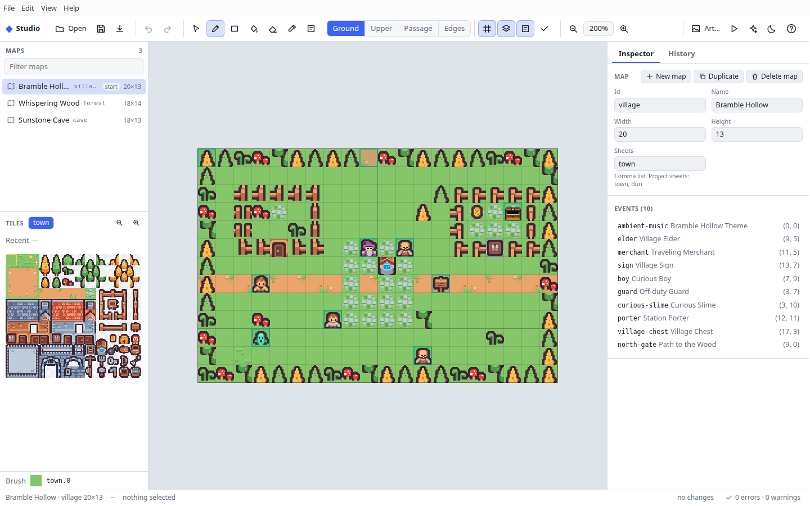

# Studio desktop app

The desktop app is [Studio](studio.md) in an Electron window. The editor is
the same web build; the desktop app adds what a web page cannot do:

- **Project folders and files saved in place.** Open a folder holding
  `project.json` and its map files, or any single project file, and Save
  writes back to it. Only the changed map files and the shell are written.
- **Local agents.** Ask an agent on your computer (traecli, Claude Code or
  your own command) for a change. Its edits come back as a proposal that you
  accept or reject in the Agent panel.
- **Engine checks.** Run `rpgkit-check`'s engine checks (`locks`, `freeze`,
  `reach`) on your computer. Their findings join the problems list.
- **A desktop window.** File, Edit, View and Help menus, Open Recent, a
  prompt before closing with unsaved changes, and files handed over by the
  operating system ("Open With", the Dock, the command line).

Play-test, art, checks and every editing feature work as on the web page.



## Status

Built and tested on Linux: the build, an unpacked package, and an
end-to-end test of the real app (below). macOS packages are built, signed
and notarized by a GitHub Actions workflow. That workflow has not run yet
because the signing secrets are not set up; without them it produces an
unsigned build. Windows is not packaged.

## Build and run

You need Bun and Node.js (Node only runs the end-to-end test). The app has
its own `package.json` and lockfile in `studio-desktop/`, outside the kit's
Bun workspace, so Electron never enters the kit's dependencies.

```sh
bun install && bun run build:wasm         # at the kit root, once
cd studio-desktop
bun install --frozen-lockfile             # Electron, electron-builder, Playwright (driver only)
bun run build                             # fills studio-desktop/app/
bun run start                             # opens the app
```

`bun run build` (`studio-desktop/build.ts`) puts everything in `app/`:

| Path | What |
|---|---|
| `app/main.cjs`, `app/preload.cjs` | The main process and the preload, bundled by Bun for Node |
| `app/site/studio/` | Studio, built by `tools/studio-build.ts` with the desktop entry (`editor/studio/main-desktop.ts`) and the desktop host |
| `app/site/preview/`, `player.js`, `pocketjs.wasm`, `site.css` | The play-test's game page, built by `tools/web.ts` |
| `app/helper/rpgkit-studio-helper` | `studio-desktop/src/helper.ts` compiled with `bun build --compile`: local agents, the agent's MCP server and the engine checks |

Packages:

```sh
bun run dist:linux    # dist/linux-unpacked/ (and electron-builder's other Linux targets with `bun run dist`)
bun run dist:mac      # universal dmg + zip, on a Mac (see "Signing and releases")
```

On Linux machines without unprivileged user namespaces (many containers,
Ubuntu 24.04 with its default AppArmor rules) Chromium's own process
sandbox cannot start; pass `--no-sandbox` there. The page's sandbox
(`webPreferences.sandbox`: no Node in the page, a sandboxed preload) stays
on either way.

### Options

| Option | Effect |
|---|---|
| `--agent-config=<file>` | The local agent to use. Without it Studio reads `agent.json` from its profile folder, and without that it looks for `traecli` on `PATH`. |
| `--studio-user-data=<dir>` | Use another profile folder (tests, a second copy side by side). |
| `<path>` | Open a project file or folder at start. |

The profile folder is Electron's `userData`: `~/.config/Pocket RPG Kit
Studio` on Linux, `~/Library/Application Support/Pocket RPG Kit Studio` on
macOS. It holds the stored document (a Save of a document that came from no
file), `recent.json` and the optional `agent.json`.

## What the desktop app adds

### Files and folders

**Open** (toolbar) or **File → Open File…** opens an inline project or a
sharded pack; **File → Open Folder…** (Ctrl/⌘+Shift+O) opens a project
folder. The folder rules are those of the web page's folders (see
[Studio: Project folders](studio.md#project-folders)).

Save writes back where the document came from:

- **A folder.** Studio compares every file it is about to replace with the
  bytes it read. If any changed on disk, nothing is written and Studio says
  which file. Otherwise every new text is staged next to its target, the
  targets are checked once more, and the files are renamed into place: map
  files first, the shell last. If a rename fails, the files already
  replaced get their old bytes back. The whole step holds the shell's
  `.rpgkit-edit.lock`, the lock `rpgkit-edit` and its MCP server take, so a
  Studio save never interleaves with a script's or an agent's direct edit.
  This is `editor/api/file.ts`, the code `rpgkit-edit` uses.
- **A single file.** The same check and an atomic replace under the same
  lock.
- **Neither** (an example, a restored document): the profile folder.

**Export…** (Ctrl/⌘+Shift+E) writes the exact export bytes to a file you
choose.

The page never sees a real path. The main process keeps the path and gives
the page a random token for each opened file or folder. Folder access is
confined to the folder you picked: relative POSIX paths only (no absolute
paths, `..`, backslashes or empty segments), and symbolic links are
followed and must stay inside the folder.

### Local agents

The **agent** button in the toolbar opens the Agent panel. Type a request
and press **Send**. Studio sends the agent the current document, the open
map and what is selected on it. The agent works on a scratch copy in the
profile folder and can only create a proposal, through a proposal-only
`rpgkit-edit` MCP server. It cannot change your document. The proposal
lists its changes, each marked clean or in conflict with edits you made
meanwhile. **Accept** applies the clean ones as one undo step; **Reject**
drops it.

The agent runs as a process of its own: a fixed command line with no
shell, an environment limited to an allowlist, its own process group
(Cancel and timeouts stop the whole group), and a timeout. The
configuration file has the same format as the PocketJS editor's
`--agent-config` (`editor/agent-config.example.json`; adapters and
placeholders are in the
[agent integration reference](edit-api.md#editor-local-agent-integration)).
For example, for Claude Code:

```json
{ "adapter": "claude", "timeoutMs": 300000 }
```

macOS starts apps from Finder with a minimal `PATH`. If the agent is not
found, give its absolute path in `command`.

Agents work on single-file projects for now: proposals cannot describe
edits to a sharded pack, so the panel says so for folders and packs.

### Engine checks

**View → Run Engine Checks**, or **Run engine checks** in the problems
panel, runs `rpgkit-check`'s `lint`, `locks`, `freeze` and `reach` on the
open inline document, in a separate process with a time limit. Findings are
listed with the static lint and jump to their map, event and page like the
others. `shot` and `explore` are not included.

### Window, menus and shortcuts

| Menu | Items |
|---|---|
| File | Open File… (Ctrl/⌘+O), Open Folder… (Ctrl/⌘+Shift+O), Open Recent, Save (Ctrl/⌘+S), Export… (Ctrl/⌘+Shift+E), Quit / Close |
| Edit | Undo, Redo (Studio's history; in a text field, the field's own), Cut, Copy, Paste, Select All |
| View | Problems, Run Engine Checks, Agent, Play-test (Ctrl/⌘+Enter), Toggle Light/Dark, Full Screen |
| Help | Keyboard Shortcuts, Studio Desktop Documentation, About |

All of Studio's own shortcuts work as on the web page. Closing the window
with unsaved changes asks first (**Discard Changes** or **Cancel**).

## Security

| Setting | Value |
|---|---|
| Page | `contextIsolation: true`, `sandbox: true`, `nodeIntegration: false`, `nodeIntegrationInSubFrames: false`, `webviewTag: false` |
| Bridge | `window.studioDesktop`: a fixed list of functions, each one IPC call. `ipcRenderer` itself is not exposed. |
| IPC | Every handler checks that the sender is Studio's own top-level page (`app://studio/studio/…`, not the play-test frame) and validates its arguments. |
| Content | Served from `app://studio/` (a registered standard, secure scheme) out of the app's own files; paths outside them are refused. |
| CSP, Studio | `default-src 'self'; script-src 'self'` (no inline or eval'd script), images from the app and `blob:`, frames from the app only, `frame-ancestors 'none'`. Inline style attributes are allowed (Studio's DOM helpers set them). |
| CSP, play-test page | As above plus `'wasm-unsafe-eval'` and `'unsafe-eval'` (the web player starts the bundled game script with `Function`), and it may be framed only by Studio. It runs only the app's bundled scripts; project documents are data the engine reads. |
| Navigation | No navigation away from `app://studio/`, no new windows (`https://` links open in the system browser), no `<webview>`, every permission request denied. |
| Helper | Started with a fixed argv, no shell and an allowlisted environment. Its first input line must carry a random token made for that launch, or it exits. |
| Fuses (packaged app) | `RunAsNode`, `EnableNodeOptionsEnvironmentVariable`, `EnableNodeCliInspectArguments` and `GrantFileProtocolExtraPrivileges` off; `EnableEmbeddedAsarIntegrityValidation`, `OnlyLoadAppFromAsar` and `EnableCookieEncryption` on. |

## Tests

```sh
cd studio-desktop
bun run build
bun run e2e        # needs a display; starts Xvfb itself when DISPLAY is unset (or set XVFB to its path)
```

`e2e/run.ts` prepares the fixtures (Sunstone as a project folder, the same
folder with its own art (an autumn `art/sheets/town.png` and a recoloured
`assets/npc/wiz.png`), an agent
config for the kit's offline fake agent `tests/fixtures/fake-local-agent.ts`,
and `tests/fixtures/rpgkit-check/broken.json`). Then
`e2e/studio-desktop.test.mjs` drives the built app with Playwright's
Electron support. Native dialogs are answered by replacing them in the main
process; everything after them is the real app. The tests check:

- the page's isolation, sandbox, CSP, bridge and refused path traversal;
- open the Sunstone folder, paint one cell, save: exactly `maps/village.json`
  and `project.json` change, the other files are not rewritten, and no
  staging or lock files are left;
- a map file changed on disk since opening blocks the save, with nothing
  written;
- the folder appears in Open Recent;
- the offline fake agent returns a proposal through the compiled helper's MCP
  server, and accepting it is one undo step;
- engine checks find `reach/transfer-target-missing` and it joins the
  problems list;
- the art folder opens with its own town sheet and wizard sprite on the
  canvas (checked by pixel), and the play-test uses both images;
- the play-test starts the game at the selected cell, and the game frame
  cannot reach the bridge;
- closing with unsaved changes asks; Cancel keeps the window and Discard
  closes it.

The packaged app turns off the inspector (a fuse), so Playwright cannot
drive it; the tests run the same `app/` with the development Electron.
Screenshots are written to `docs/screenshots/studio-desktop/`.

Kit-side tests: `tests/studio-desktop-helper.test.ts` (the helper's
protocol, token, checks, agent runs, cancel and timeout, and the compiled
binary), `tests/studio-desktop-fs.test.ts` (folder confinement and in-place
saves on the real file system), `tests/studio-agent-panel.test.ts`
(proposal review) and `tests/studio-host.test.ts` (the host boundary).

## Signing and releases

### Signing and notarizing on CI

The "Studio desktop" workflow (`.github/workflows/studio-desktop.yml`)
builds one universal macOS app (Apple Silicon and Intel) and uploads two
files as a workflow artifact:

- `pocket-rpgkit-studio-<version>-universal.dmg`, for first installs.
- `pocket-rpgkit-studio-<version>-universal.zip`, the same app zipped (and
  its `.blockmap`). A future auto-updater would use the zip.

What the workflow does depends on the repository secrets:

| Secrets present | Result |
|---|---|
| All five | Signed with your Developer ID, notarized by Apple, ticket stapled to the app and to the dmg. Opens without warnings. |
| Certificate only (`MAC_CERT_P12_BASE64`, `MAC_CERT_PASSWORD`) | Signed, but not notarized. Gatekeeper still warns on first launch. A notice in the run says so. |
| None | Unsigned build (ad-hoc signature only, so it runs on Apple Silicon). A notice in the run says so, and the job still passes. |

With a certificate, the workflow signs the bundled helper (the compiled
`rpgkit-studio-helper` that runs checks and the agent's MCP server) with
its own entitlements first. electron-builder then signs the app and,
when the API key is present, notarizes the app and staples the ticket.
After that the workflow signs the dmg, notarizes it with `notarytool`
and staples the dmg as well. The run then checks both with `codesign`,
`stapler` and `spctl`. The signing keychain and the API key file live in
the runner's temporary directory and are deleted at the end of the job,
even when it fails.

#### Releasing

1. Set `version` in `studio-desktop/package.json` (for example `0.2.0`)
   and merge it.
2. Push a matching tag. The workflow fails if the tag and the version
   differ.

   ```sh
   git tag studio-v0.2.0
   git push origin studio-v0.2.0
   ```

   Or run the workflow by hand: Actions → Studio desktop → Run workflow.
   A manual run does not check the version.
3. Download the artifact from the run's summary page (it is kept for 14
   days), check it as shown below, and attach the dmg and zip to a GitHub
   release.

#### Checking a downloaded build

```sh
# The app: signer, team, hardened runtime, timestamp
codesign -dv --verbose=4 "/Applications/Pocket RPG Kit Studio.app"
codesign --verify --deep --strict --verbose=2 "/Applications/Pocket RPG Kit Studio.app"

# Gatekeeper's verdict: expect "accepted" and "source=Notarized Developer ID"
spctl -a -vvv "/Applications/Pocket RPG Kit Studio.app"
spctl -a -vvv -t install pocket-rpgkit-studio-0.2.0-universal.dmg

# The stapled tickets
xcrun stapler validate "/Applications/Pocket RPG Kit Studio.app"
xcrun stapler validate pocket-rpgkit-studio-0.2.0-universal.dmg
```

#### Notes

- **Apple Developer Program.** A Developer ID certificate and notarization
  both need a paid Apple Developer Program membership. On a team, the
  Account Holder usually has to create the Developer ID Application
  certificate.
- **No App Sandbox.** Studio starts a user-installed agent CLI and reopens
  project folders by path. The sandbox would block both, so the app uses
  the hardened runtime without the sandbox. That also means it cannot be
  sold through the Mac App Store.
- **Entitlements.** The app has only `com.apple.security.cs.allow-jit`
  (V8 needs it). The helper has the set Bun documents for compiled
  executables (`studio-desktop/build-resources/entitlements.helper.plist`);
  remove the ones a signed test run shows it does not need.
- **Universal build.** One download works on Apple Silicon and Intel Macs.
  The helper is compiled for both and merged into one universal binary
  before packaging.
- **Unsigned builds and Gatekeeper.** macOS blocks an unsigned app
  downloaded from the internet. Right-click the app and choose Open (on
  macOS 15 and later: try to open it once, then System Settings → Privacy &
  Security → Open Anyway), or remove the quarantine flag:

  ```sh
  xattr -dr com.apple.quarantine "/Applications/Pocket RPG Kit Studio.app"
  ```

- **Local builds.** `bun run dist:mac` on a Mac signs with the first
  Developer ID Application identity in your keychain and notarizes when the
  three `APPLE_API_*` variables are set. It signs the helper with the app's
  entitlements, not the helper's, and does not notarize the dmg; use CI for
  release builds.

### Repository secrets

Add these under Settings → Secrets and variables → Actions → Repository
secrets, or with the GitHub CLI. None of them is ever printed in the logs.

| Secret | What it is | How to create it |
|---|---|---|
| `MAC_CERT_P12_BASE64` | Your Developer ID Application certificate and its private key, as a base64-encoded `.p12` file. | 1. Create the certificate: in Xcode, Settings → Accounts → your team → Manage Certificates → + → Developer ID Application. (Or on developer.apple.com → Certificates, IDs & Profiles → Certificates → + → Developer ID Application, with a CSR from Keychain Access → Certificate Assistant → Request a Certificate From a Certificate Authority.) 2. In Keychain Access, open the login keychain → My Certificates, select "Developer ID Application: <name> (<team id>)", and choose File → Export Items… → `.p12`. Set a strong password. 3. `base64 -i cert.p12 \| pbcopy` and paste the result as the secret, or use `gh` as shown below. |
| `MAC_CERT_PASSWORD` | The password you set when exporting the `.p12`. | Paste it as the secret. |
| `APPLE_API_KEY` | An App Store Connect API private key (the contents of `AuthKey_<key id>.p8`). Used to notarize. | App Store Connect → Users and Access → Integrations → App Store Connect API → Team Keys → +. Give it the Developer role. Download `AuthKey_<key id>.p8`; Apple lets you download it only once. Paste the whole file contents, including the `BEGIN` and `END` lines. |
| `APPLE_API_KEY_ID` | The key's ID, for example `2X9R4HXF34`. | Shown in the Key ID column next to the key. It is also the part of the file name after `AuthKey_`. |
| `APPLE_API_ISSUER` | Your team's issuer ID, a UUID. | Shown as "Issuer ID" above the list of team keys on the same page. |

Setting them with the GitHub CLI, from the repository directory:

```sh
base64 -i cert.p12 | gh secret set MAC_CERT_P12_BASE64
gh secret set MAC_CERT_PASSWORD               # prompts for the value
gh secret set APPLE_API_KEY < AuthKey_2X9R4HXF34.p8
gh secret set APPLE_API_KEY_ID --body 2X9R4HXF34
gh secret set APPLE_API_ISSUER --body 01234567-89ab-cdef-0123-456789abcdef
```

Delete the local `.p12` and `.p8` files afterwards, or keep them only in a
password manager.

If a secret is missing:

- No `MAC_CERT_P12_BASE64`: the build is unsigned (see the table above).
  The other four secrets are ignored.
- Any of the three `APPLE_API_*` missing: the build is signed but not
  notarized.
- A wrong certificate password or a `.p12` without a Developer ID
  Application identity: the job fails at "Set up signing".
- A wrong or revoked API key: the job fails when notarizing. Apple's log
  for the rejected submission is printed in the step output.

## Limits

- Agents work on single-file projects; folders and sharded packs cannot get
  proposals yet.
- A folder save is staged, rechecked and rolled back on failure, but it is
  several renames, not one: a crash or power loss between two of them can
  leave new map files next to an old shell. Saving again finishes it.
- Saving cannot add, remove or rename map files in a folder (as on the web
  page); use Export.
- No auto-update. Download a new build.
- Windows is not packaged, and the Linux package is not signed.
- The macOS build has not run with real signing secrets yet. The helper's
  entitlements are Bun's documented set and may be more than it needs.
