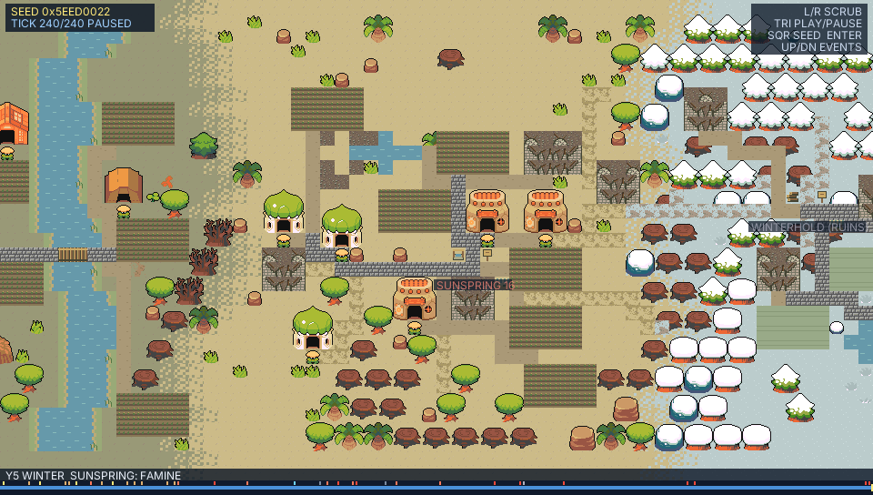
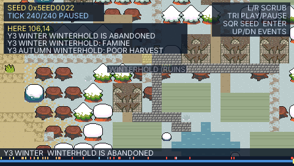

# `examples/grow` — a world that grows from causes

Four villages are founded one after another along a 4,096-column strip that
runs through grass, mud, sand and snow. Nothing in the finished world is
drawn from a template: villages settle beside water, plough the wettest
ground, log the nearest trees, quarry rock, and build a house when their
people outgrow their homes. Roads are the ground worn down by the people
who walk it. Two villages that can each spare what the other lacks trade,
and their caravans wear a road between them. A village that runs out of
food (or of firewood in winter) loses people, its empty houses fall into
ruin, and in the worst case it is abandoned. Every one of these moments is
written to an event record that the timeline shows and that can be queried.

| | |
| --- | --- |
|  |  |

```sh
bun run build:example grow     # or: bun tools/build-example.ts grow
bun run desktop grow           # desktop window
bun run web                    # web gallery, includes grow
```

## Controls

| Input | Effect |
| --- | --- |
| **L / R** (hold to repeat), touch or drag on the bottom strip | Seek the timeline to any tick |
| **UP / DOWN** | Jump to the previous / next major event; the camera holds on its place |
| Touch or click on the map | "Here": list what happened within a few tiles of that place up to the current tick |
| **TRIANGLE** | Play / pause the growth |
| **SQUARE** | A new seed |
| **CIRCLE** (when finished) | Walk into the grown world, played as a generated `rpgkit-project/v1` document |

The caption bar shows the year, the season and the latest major event in
view; coloured marks on the timeline strip are the major events (yellow
founding, blue trade, brown roads and bridges, red hardship, grey
abandonment, violet outside interventions).

## The rules

The simulation is `grow-causal.ts`, driven by `stepGrowTick` in `grow.ts`.
One tick is a few days; `seasonTicks` ticks make a season, four seasons a
year, and the world settles after `years` years (240 ticks by default).

**Resources.** Each biome band gets a water source (a stream in grass and
mud, an oasis in sand, a lake in snow), a rock outcrop, and its wild trees
(coordinate-hashed from the seed, as before). A felled tree leaves a stump
that becomes a sapling and then a full tree again after two regrowth
periods, unless the cell has since been trodden or built on. Quarried rock
leaves gravel and does not come back.

**Water.** Each source holds a stored level (80) that recharges by a flow
every tick: streams run deep (40), lakes are shallower (16) and oases
shallower still (24), so a desert town's growth is capped by its water.
Villagers carry drinking water from up to 14 tiles away; a village drinks
one unit per person per tick, half as much again in summer, and keeps a
cistern of about four units per person. Each tick's draw is capped by the
source's stored level plus its flow, so a drained source still yields its
flow every tick; only a source beyond reach, or one diverted away, gives
nothing. A village whose cistern runs dry is thirsty; three bad ticks in a
row (thirst, hunger or winter cold) stop expansion and drive people away,
one at a time, to the best-fed neighbour with room, if there is one (a
`drought` on the record, once a season). A village down to two people is
abandoned. A `dry` intervention diverts a band's source — its cells return
to wild ground — for counterfactual runs and for changing the past.

**Villages.** A band's village is founded every `foundEvery` ticks on dry
ground a short walk from its water, with five settlers and stores sized for
its climate. Each tick a village:

1. harvests its fields (yield depends on the biome, the season, how close
   the field is to water and whether this season's harvest was poor), eats
   one food per person and loses a little to spoilage;
2. burns firewood, much more in winter and most in the snow;
3. carries drinking water from its source (above);
4. cuts trees while wood is short (nearest first) and quarries rock once
   it has roads to pave;
5. grows by one person when fed, watered and housed, or loses people while
   hungry, cold or thirsty for three ticks running — leavers move to the
   best-fed neighbour with room;
6. builds one thing when it is not hungry or thirsty: a field when the
   fields cannot feed everyone (never in winter), otherwise a house when
   the people are close to outgrowing their homes. Sites are scored by
   distance from the plaza and from water; fields go to the wettest free
   ground;
7. sends people walking (see below).

Houses beyond what the people need stand empty; a house empty for two
seasons falls into a ruin of rubble and broken walls. A village with two or
fewer people that is still starving is abandoned; its houses empty and fall
one by one.

**Roads that are walked into being.** Each village keeps routes from its
plaza to every occupied house, to its water, to each field, to the current
woodlot and to the quarry. Routes are the cheapest paths (Dijkstra, integer
step costs, ties by cell order) over an 18-column window either side of the
plaza. Step costs make roads attract feet:

| Ground | Cost |
| --- | --- |
| Paved road / bridge | 2 |
| Dirt road | 3 |
| Trodden trail | 5 |
| Wild ground (grass, mud, sand, snow) | 6, 7, 8, 8 (+2 under scrub, +12 through trees) |
| Field | 14 |
| Water (until bridged) | 36 |
| House walls, wells, rocks | impassable |

Every tick one route is walked, carrying the footfall of all the trips
since it was last walked. Each cell counts its footfall (`wear`); at
`wornAt` it becomes a trodden trail, at `roadAt` a dirt road (shrubs on it
are cleared), and at `pavedAt` the village pays one stone to pave it.
Water crossed `roadAt` times gets a plank bridge for two wood. Routes are
recomputed when the village changes (a new house, a new field, a new road
cell), so new roads pull later trips onto themselves.

**Trade.** Villages within `tradeRange` bands of each other look for a
mutual deal every tick: each must have a surplus of something the other
needs (food, wood or stone; snow villages need twice the food stores). A
deal opens a trade route along the cheapest plaza-to-plaza path and puts a
market stall on each partner's plaza the first time. The route carries the
live deal: its goods are re-checked every tick and updated when the
villages' surpluses change. Every `caravanEvery` ticks a caravan carries
up to 12 of each good each way and treads the route (weight 8), re-routing
along its own worn road every six trips — but only while a deal with
something to spare exists; a dispatch tick with no deal, or with nothing
to spare either way, sends no caravan, wears no road and draws no cart.
When 80% of the route is road, the record notes that the caravans have
worn a road. Without a deal for two seasons, the route falls silent; with
no trade at all there is no route and no footfall between villages.

### Parameters (`CausalParams`, `DEFAULT_CAUSAL`)

| Field | Default | Meaning |
| --- | --- | --- |
| `years` | 5 | Simulated years before the world settles |
| `seasonTicks` | 12 | Ticks per season |
| `foundEvery` | 10 | Ticks between village foundings |
| `wornAt` / `roadAt` / `pavedAt` | 24 / 90 / 260 | Footfall for a trail / dirt road / paved road |
| `caravanEvery` | 4 | Ticks between caravans on an open route |
| `tradeRange` | 2 | Furthest band apart two villages may trade |
| `interventions` | none | Outside changes to history (see below) |

`STAMP_PARAMS` (no `causal` field) still grows the original stamped world
of roads, centres, houses and work yards; `DEFAULT_PARAMS` is the causal
world with seed `0x5EED0022`.

## The event record

`state.sim.events` is an append-only list of `GrowEvent { tick, kind, x, y,
settlement, other?, goods?, returns?, amount?, detail? }` in tile
coordinates (`detail: "dry"` marks a diverted source). Kinds: `founded`,
`house`, `field`, `first-road`, `paved`, `bridge`, `market`,
`trade-opened`, `trade-road`, `trade-lapsed`, `poor-harvest`, `famine`,
`cold`, `drought`, `forest-cleared`, `exodus`, `ruin`, `abandoned`,
`intervention`.
`MAJOR_EVENTS` are the ones the timeline marks.

Queries (all pure):

| Function | Returns |
| --- | --- |
| `eventsNear(state, x, y, radius?, tick?)` | Events within `radius` tiles of a place up to `tick` |
| `eventsBetween(state, from, to)` | Events in a tick range |
| `eventsOf(state, settlement)` | Events naming a village, as actor or trade partner |
| `latestMajorEvent(state, tick?, x0?, x1?)` | The latest major event, optionally within columns |
| `describeEvent(state, event)` | A short uppercase caption |
| `causalSummary(state)` | Per-village people, stores, houses, ruins, roads; trade links |

The walk-in project carries the history too: each village's notice board
reads its founding, its population and its last few major events.

## Changing history

`GrowIntervention` is `{ tick, kind: "supply", settlement, goods, amount }`,
`{ tick, kind: "blight", settlement }` (that season's harvest fails) or
`{ tick, kind: "dry", settlement }` (the settlement's water source is
diverted). Put them in `causal.interventions` to fold a different history from
tick 0, or call `forkGrow(stateAtK, interventions)` and keep stepping: a
fork at tick k with interventions after k reaches exactly the state that
folding those interventions from tick 0 does.

## Determinism and seeking

The reducer is pure: all randomness is the state's RNG cursor or a hash of
the seed and a coordinate, arithmetic is integer, and arrays a later state
may share are replaced, never edited. The same seed and tick always give
byte-identical grids and records; `tests/grow-causal.test.ts` checks this,
and that 60 Hz frame folding, tick folding and timeline seeks in any order
agree.

`GrowTimeline` (`grow-timeline.ts`) records each tick's grid edits once as
the world grows (one tick per frame at 60 Hz until all 240 are recorded;
scrubbing ahead of the recording folds every missing tick in that frame)
and seeks by replaying
edits forwards or backwards on one reusable set of grids, so a seek never
re-simulates. `at(k)` without a reusable state and `snapshot(k)` return
copies of the tick's grids, so a state the caller keeps is not rewritten by
a later seek; the UI passes its own state as a reusable buffer, so its seeks
allocate nothing.

On the desktop QuickJS guest (`tools/grow-quickjs-bench.sh`, CPU 9) the
default causal world costs about 13–16 ms per simulated tick on average,
with a p95 around 33 ms and single ticks up to about 47 ms on a loaded
machine; the full 240-tick timeline takes about 3 s of background
recording, and any seek stays under 5 ms. The bench measures the reducer,
the timeline and seeks, not a whole GrowView frame, so while the history is
still recording a frame that folds a tick can exceed the 16.7 ms budget of
60 Hz (the previous two ticks per frame were about twice as slow).
Recording the whole timeline retains about 9.9 MB of QuickJS heap, 13.2 MB
with the seek cursor.

## Files

| File | Role |
| --- | --- |
| `grow.ts` | State, the stamp rules, the tick/frame reducers, grid hashing |
| `grow-causal.ts` | The causal rules, event record, queries and `forkGrow` |
| `grow-timeline.ts` | Edit-recording timeline and seeking |
| `grow-stamps.ts`, `grow-art.ts`, `assets-grow.ts`, `gen-assets.ts` | Multi-tile stamps and generated art |
| `grow-project.ts` | The finished world as an `rpgkit-project/v1` document |
| `GrowView.tsx`, `grow.tsx` | The demo: camera, HUD, timeline strip, walk-in |

Art credits are in [ATTRIBUTION.md](ATTRIBUTION.md).
